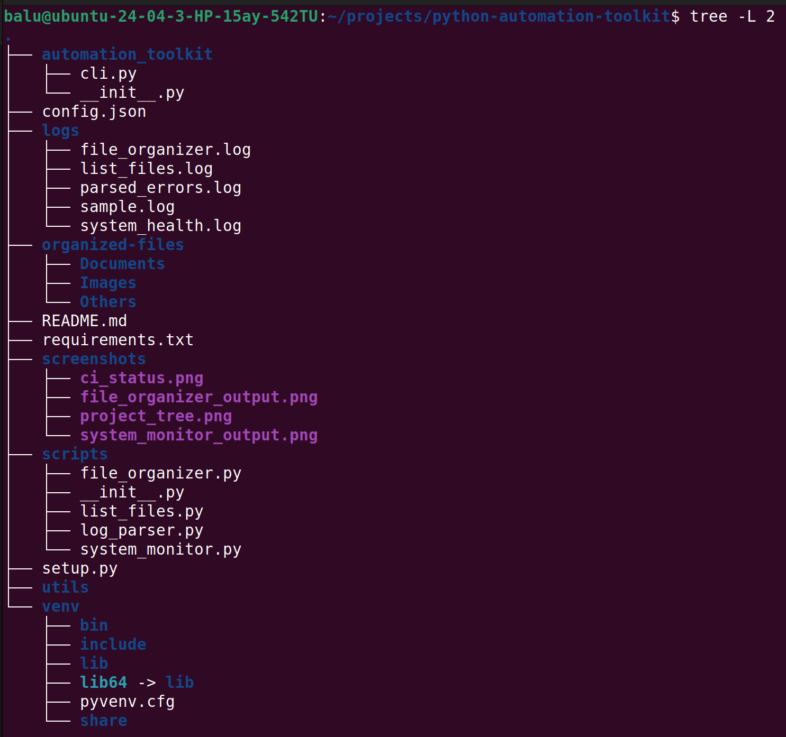
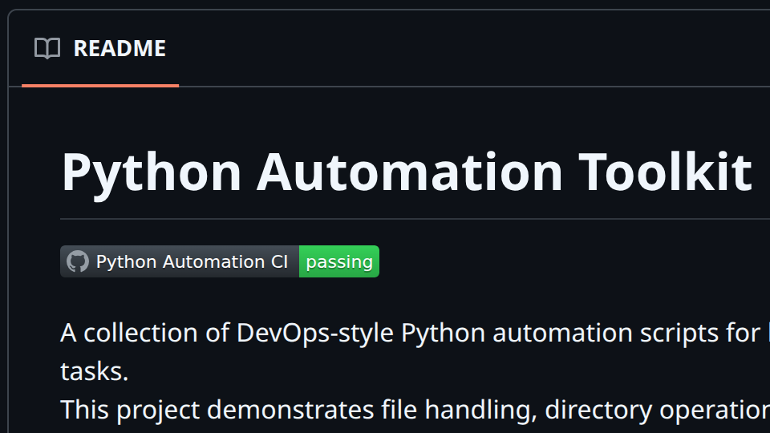
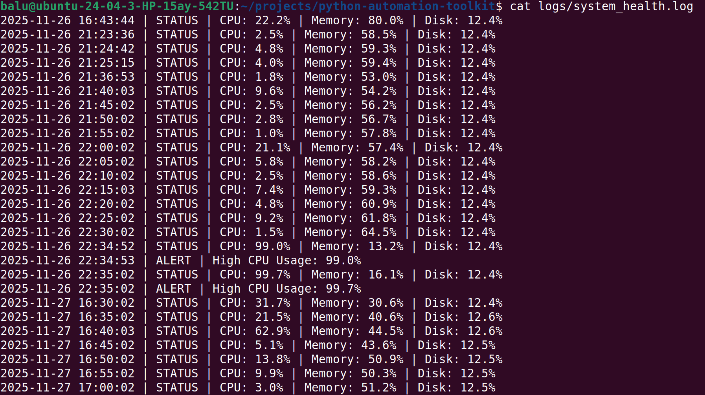
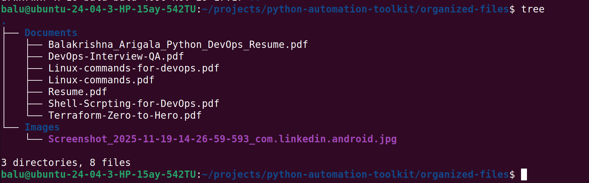

# Python Automation Toolkit
[](https://github.com/balakrishna-arigala26/python-automation-toolkit/actions/workflows/python-ci.yml)

A collection of DevOps-style Python automation scripts for learning and practicing real-world automation tasks.  
This project demonstrates file handling, directory operations, logging, and Linux-friendly scripting workflows — skills commonly used by DevOps, SRE, and Production Support Engineers.

---

## 📁 Project Structure

```bash
python-automation-toolkit/
│── scripts/             → All Python automation scripts
│── utils/               → Helper modules (future use)
│── logs/                → Log output files
│── organized-files/     → Output folder for file organizer script
│── README.md            → Documentation
```

---

## 🧩 Included Automation Scripts

### **1️⃣ List Files Script**

Lists all files inside a specified directory and logs the results with timestamps.

**Run:**

```bash
python3 scripts/list_files.py
```

**Logs saved at:**

```bash
logs/list_files.log
```

---

### **2️⃣ File Organizer Script**

Organizes files by type (Images, Documents, Archives, Scripts, Others) into structured folders.

**Run:**

```bash
python3 scripts/file_organizer.py
```

**Logs stored at:**

```bash
logs/file_organizer.log
```

**Organized output:**

```bash
organized-files/
```

---

### **3️⃣ Log Parser Script**

Parses a log file and extracts all **ERROR** and **WARNING** messages using regex.  
Useful for monitoring, troubleshooting, and automated alerting.

**Run:**

```bash
python3 scripts/log_parser.py
```

**Parsed output stored at:**

```bash
logs/parsed_errors.log
```

---

### **4️⃣ System Health Monitor Script**

Monitors **CPU**, **Memory**, and **Disk** usage and logs alerts when thresholds are exceeded.  
Useful for server monitoring, cron automation, and cloud observability.

**Run:**

```bash
python3 scripts/system_monitor.py
```

**Output stored at:**

```bash
logs/system_health.log
```

⏱ **Cron Automation (Optional)**
To run the system monitor automatically every 5 minutes:

```bash
crontab -e
```

Add this line:

```bash
*/5 * * * * /home/balu/projects/python-automation-toolkit/venv/bin/python /home/balu/projects/python-automation-toolkit/scripts/system_monitor.py
```

This enables background monitoring without manual execution, similar to production server tasks.

---

## 🎯 Purpose of This Toolkit

This project helps practice automation concepts used in:

- DevOps
- SRE (Site Reliability Engineering)
- Production Support
- Python scripting
- Linux system automation
- Git-based development workflow

Skills covered:

- File operations
- Directory manipulation
- Log parsing using regex
- System health monitoring
- Writing clean command-line automation tools
- Logging & timestamping for observability
- Git & GitHub version control

---

## 🚀 How to Run Any Script

From the **project root directory**:

```bash
python3 scripts/<script_name>.py
```

Example:

```bash
python3 scripts/system_monitor.py
```

---


## 📸 Screenshots

### 🔹 Project Folder Structure
Displays the complete directory layout of the Python Automation Toolkit.



### 🔹 CI Pipeline Status
GitHub Actions CI pipeline passing successfully after automated validation and script execution.



### 🔹 System Monitor Output
Shows real system resources metrics logged by the automated CPU/Memory/Disk monitoring script.



### 🔹 File Organizer Output
Demonstrates files neatly categorized by type into Images/Documents/Scripts using the automation script.



---


## 📌 License

This project is for personal learning and practice.
